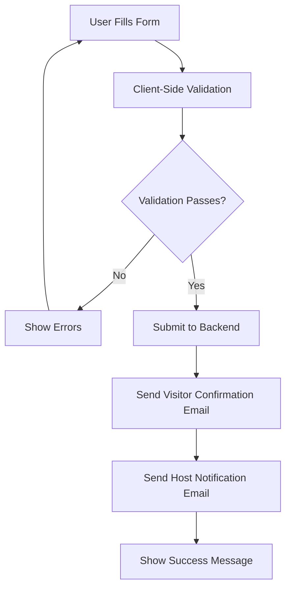

# Visitor Management System - Complete Context Documentation

## 🏢 System Overview

The **Universal Visitor Management System** is a production-ready, multi-tenant web application built with React, TypeScript, and Tailwind CSS. It provides a comprehensive solution for managing visitor registrations across different organizations, with a focus on security, user experience, and scalability.

### Core Philosophy
- **Universal Template**: Easily customizable for any company or organization
- **Production-Ready**: Optimized for performance, security, and real-world deployment
- **Modern Architecture**: Built with latest web technologies and best practices
- **Responsive Design**: Works seamlessly across all devices and screen sizes

---

## 🎨 User Interface Architecture

### Design System

#### Color System
The application uses a dynamic theming system that automatically generates color variants:

```typescript
// Primary brand colors are configurable per organization
colors: {
  primary: "#2563eb",    // Blue-600 (customizable)
  secondary: "#f97316",  // Orange-500 (customizable)
  accent: "#059669",     // Emerald-600 (success states)
  background: "#f8fafc", // Slate-50 (page backgrounds)
  surface: "#ffffff"     // White (card backgrounds)
}
```

**Auto-generated Variants:**
- Primary: 50, 100, 200, 300, 400, 500, 600, 700, 800, 900
- Secondary: 50, 100, 200, 300, 400, 500, 600, 700
- Automatic contrast adjustments for accessibility

#### Typography & Spacing
- **Font System**: System fonts with fallbacks for optimal performance
- **Spacing**: Consistent 8px grid system
- **Line Heights**: 150% for body text, 120% for headings
- **Font Weights**: Maximum 3 weights for performance

#### Responsive Breakpoints
- **Mobile**: < 640px (sm)
- **Tablet**: 640px - 1024px (md/lg)
- **Desktop**: > 1024px (xl)

### Component Architecture

#### Core UI Components

1. **FormField Component** (`src/components/FormField.tsx`)
   - Standardized form input wrapper
   - Icon integration with Lucide React
   - Error state management
   - Responsive label positioning

2. **PhoneInput Component** (`src/components/PhoneInput.tsx`)
   - International country code selection
   - Phone number validation
   - Prevents numbers starting with 0
   - Responsive layout (stacked on mobile, inline on desktop)

3. **HostSelect Component** (`src/components/HostSelect.tsx`)
   - Dynamic host selection from company configuration
   - Custom dropdown styling
   - Integration with company data

4. **ProgressBar Component** (`src/components/ProgressBar.tsx`)
   - Real-time form completion tracking
   - Dynamic color changes based on progress
   - Motivational messaging system
   - Smooth animations and transitions

5. **OptimizedImage Component** (`src/components/OptimizedImage.tsx`)
   - Lazy loading with intersection observer
   - Placeholder support
   - Priority loading for critical images
   - Performance optimizations

#### Layout Components

1. **ThemeProvider** (`src/components/ThemeProvider.tsx`)
   - Dynamic CSS custom property injection
   - Company configuration context
   - Color variant generation
   - Theme switching capabilities

---

## 📱 User Interface Flows

### Visitor Registration Flow

#### 1. Landing Page (`src/pages/VisitorForm.tsx`)

**Visual Hierarchy:**
```
┌─────────────────────────────────────┐
│           HEADER SECTION            │
│  ┌─────────────────────────────────┐ │
│  │     Company Logo (Large)        │ │
│  │   "Visitor Registration"        │ │
│  │    Welcome Message              │ │
│  └─────────────────────────────────┘ │
├─────────────────────────────────────┤
│         PROGRESS SECTION            │
│  ┌─────────────────────────────────┐ │
│  │    Dynamic Progress Bar         │ │
│  │   Completion Percentage         │ │
│  │   Motivational Message          │ │
│  └─────────────────────────────────┘ │
├─────────────────────────────────────┤
│           FORM SECTION              │
│  ┌─────────────────────────────────┐ │
│  │  Personal Information Grid      │ │
│  │  Phone Number (International)   │ │
│  │  Purpose of Visit (Textarea)    │ │
│  │  Host Selection (Dropdown)      │ │
│  │  Submit Button                  │ │
│  └─────────────────────────────────┘ │
├─────────────────────────────────────┤
│          FOOTER SECTION             │
│    Privacy & Confidentiality       │
└─────────────────────────────────────┘
```

**Interactive Elements:**
- **Real-time Validation**: Immediate feedback on field completion
- **Progress Tracking**: Visual progress bar updates as fields are filled
- **Network Status**: Offline/slow connection indicators
- **Responsive Layout**: Grid collapses to single column on mobile

#### 2. Form Validation Logic

**Field Validation Rules:**
```typescript
// Visitor Name
- Required field
- Minimum 2 characters
- No special validation beyond presence

// Email Address
- Required field
- RFC-compliant email regex validation
- Real-time validation feedback

// Phone Number
- Required field
- Minimum 9 digits
- Country code integration
- Prevents leading zeros
- Numeric input only

// Purpose of Visit
- Required field
- Textarea for detailed descriptions
- Character limit considerations

// Host Selection
- Required field
- Dynamic population from company config
- Displays host name and title
```

#### 3. Progress Calculation Algorithm

```typescript
const calculateProgress = (formData) => {
  const requiredFields = [
    formData.visitorName.trim(),
    formData.visitorEmail.trim(),
    formData.phoneNumber.trim(),
    formData.purposeOfVisit.trim(),
    formData.host
  ];
  
  const filledFields = requiredFields.filter(field => field !== '').length;
  return Math.round((filledFields / requiredFields.length) * 100);
};
```

**Progress States & Colors:**
- 0%: Gray (Get started message)
- 1-24%: Red (Just getting started)
- 25-49%: Orange (Making progress)
- 50-74%: Yellow (Halfway there)
- 75-99%: Blue (Almost done)
- 100%: Green (Ready to submit)

### Dashboard Interface (`src/pages/Dashboard.tsx`)

#### 1. Dashboard Layout Structure

```
┌─────────────────────────────────────────────────────────┐
│                    HEADER BAR                           │
│  Logo + Title                              Navigation   │
├─────────────────────────────────────────────────────────┤
│                  STATS CARDS ROW                        │
│  [Total] [Approved] [Pending] [Rejected]               │
├─────────────────────────────────────────────────────────┤
│                  FILTERS SECTION                        │
│  Search Input                    Status Filter         │
├─────────────────────────────────────────────────────────┤
│                  DATA TABLE                             │
│  Visitor | Purpose | Host | Status | Date              │
│  ─────────────────────────────────────────────────────  │
│  [Visitor Data Rows...]                                │
└─────────────────────────────────────────────────────────┘
```

#### 2. Statistics Cards

**Real-time Metrics:**
- **Total Visitors**: Count of all registrations
- **Approved**: Count of approved visits
- **Pending**: Count of pending approvals
- **Rejected**: Count of rejected visits

**Visual Design:**
- Icon-based representation
- Color-coded by status type
- Responsive grid layout (2 columns mobile, 4 columns desktop)

#### 3. Data Table Features

**Desktop View:**
- Full table with all columns visible
- Sortable columns
- Hover effects for better UX
- Status badges with icons

**Mobile View:**
- Card-based layout
- Stacked information
- Touch-friendly interactions
- Condensed information display

#### 4. Filtering & Search

**Search Functionality:**
- Real-time search across multiple fields
- Searches: visitor name, email, purpose of visit
- Case-insensitive matching
- Debounced input for performance

**Status Filtering:**
- Dropdown filter for status types
- Options: All, Approved, Pending, Rejected
- Combined with search functionality

---

## 🔧 Technical Architecture

### State Management

#### 1. Form State Management (`src/hooks/useVisitorForm.ts`)

**State Structure:**
```typescript
interface VisitorFormData {
  visitorName: string;
  visitorEmail: string;
  phoneNumber: string;
  countryCode: string;
  purposeOfVisit: string;
  host: string;
}

interface FormErrors {
  visitorName?: string;
  visitorEmail?: string;
  phoneNumber?: string;
  purposeOfVisit?: string;
  host?: string;
}
```

**Key Functions:**
- `validateForm()`: Comprehensive form validation
- `updateField()`: Individual field updates with error clearing
- `submitForm()`: Async form submission with error handling

#### 2. Network Optimization (`src/hooks/useNetworkOptimization.ts`)

**Network Detection:**
```typescript
interface NetworkInfo {
  isOnline: boolean;
  effectiveType?: string;  // '4g', '3g', '2g', 'slow-2g'
  downlink?: number;       // Connection speed in Mbps
  rtt?: number;           // Round-trip time in ms
}
```

**Optimization Strategies:**
- Slow connection detection
- Timeout adjustments based on connection speed
- User feedback for network issues
- Graceful degradation for offline scenarios

### Performance Optimizations

#### 1. Image Optimization (`src/utils/imageOptimization.ts`)

**Features:**
- Lazy loading with Intersection Observer
- Placeholder images during loading
- Priority loading for critical images
- Responsive image sizing

**Implementation:**
```typescript
// Intersection Observer for lazy loading
const observer = createIntersectionObserver((entries) => {
  entries.forEach((entry) => {
    if (entry.isIntersecting) {
      // Load actual image
      setCurrentSrc(src);
      observer.disconnect();
    }
  });
});
```

#### 2. API Caching (`src/utils/apiCache.ts`)

**Caching Strategy:**
- In-memory cache with TTL (Time To Live)
- Automatic cleanup of expired entries
- Configurable cache duration per request type
- Cache invalidation on data updates

#### 3. Bundle Optimization (`vite.config.ts`)

**Code Splitting:**
```typescript
manualChunks: {
  vendor: ['react', 'react-dom'],
  router: ['react-router-dom'],
  forms: ['react-hook-form'],
  icons: ['lucide-react']
}
```

---

## 🔄 Business Logic Flows

### Visitor Registration Process

#### 1. Form Submission Flow



#### 2. Email Notification System

**Visitor Confirmation Email:**
- Professional HTML template with company branding
- Visit details summary
- Host contact information
- Important instructions (ID requirement, arrival time)
- Company contact information

**Host Notification Email:**
- New visitor alert
- Visitor details and contact information
- Purpose of visit
- Action buttons (Approve/Reject) - Future enhancement
- Timestamp and urgency indicators

#### 3. Data Flow Architecture

```typescript
// Form Submission Process
1. Client-side validation
2. Network optimization checks
3. API request with timeout handling
4. Email service integration
5. Success/error state management
6. User feedback display
```

### Company Configuration System

#### 1. Multi-tenant Architecture (`src/config/company.ts`)

**Configuration Structure:**
```typescript
interface CompanyConfig {
  name: string;           // Company display name
  logo: string;          // Logo file path
  colors: {              // Brand color system
    primary: string;     // Main brand color
    secondary: string;   // Secondary brand color
    accent: string;      // Success/accent color
    background: string;  // Page background
    surface: string;     // Card/surface background
  };
  hosts: Host[];         // Available hosts
  contact: {             // Company contact info
    email: string;
    phone: string;
    address: string;
  };
}
```

#### 2. Dynamic Theming System (`src/hooks/useTheme.ts`)

**Color Generation Process:**
1. Parse company colors from configuration
2. Convert hex colors to HSL for manipulation
3. Generate color variants (50-900 scale)
4. Inject CSS custom properties
5. Apply to Tailwind CSS classes

**Generated CSS Variables:**
```css
:root {
  --color-primary: #2563eb;
  --color-primary-50: hsl(217, 91%, 95%);
  --color-primary-100: hsl(217, 91%, 90%);
  /* ... additional variants ... */
  --color-primary-900: hsl(217, 91%, 15%);
}
```

---

## 🛡️ Security & Data Management

### Data Validation & Sanitization

#### 1. Input Validation
- **Email Validation**: RFC-compliant regex patterns
- **Phone Validation**: Numeric input with country code support
- **XSS Prevention**: Input sanitization on all user inputs
- **SQL Injection Prevention**: Parameterized queries (when using database)

#### 2. Privacy & Compliance
- **Data Minimization**: Only collect necessary information
- **Consent Management**: Clear privacy notices
- **Data Retention**: Configurable retention policies
- **GDPR Compliance**: Right to deletion and data portability

### Error Handling & Resilience

#### 1. Network Error Handling
```typescript
// Timeout handling based on connection speed
const timeoutDuration = isSlowConnection ? 60000 : 30000;
const controller = new AbortController();
setTimeout(() => controller.abort(), timeoutDuration);
```

#### 2. Graceful Degradation
- **Offline Support**: Form data preservation
- **Slow Connection Handling**: Extended timeouts and user feedback
- **Error Recovery**: Retry mechanisms and user guidance

---

## 🎯 User Experience Features

### Accessibility (a11y)

#### 1. Keyboard Navigation
- Full keyboard accessibility
- Logical tab order
- Focus indicators
- Screen reader support

#### 2. Visual Accessibility
- High contrast color ratios
- Scalable text and UI elements
- Clear visual hierarchy
- Color-blind friendly design

### Progressive Enhancement

#### 1. Mobile-First Design
- Touch-friendly interface elements
- Responsive typography scaling
- Optimized form layouts for mobile input
- Gesture-friendly interactions

#### 2. Performance Optimization
- Lazy loading for non-critical resources
- Code splitting for faster initial load
- Image optimization and compression
- Minimal JavaScript for core functionality

---

## 🔧 Configuration & Customization

### Easy Company Setup

#### 1. Configuration File Updates
```typescript
// Update company details in src/config/company.ts
export const companyConfig: CompanyConfig = {
  name: "Your Company Name",
  logo: "/your_logo.png",
  colors: {
    primary: "#your-primary-color",
    secondary: "#your-secondary-color",
    // ... other colors
  },
  hosts: [
    // Your team members
  ],
  contact: {
    // Your contact information
  }
};
```

#### 2. Asset Management
- Logo replacement in `/public/` directory
- Automatic favicon generation
- Responsive logo sizing
- Brand consistency across all pages

### Deployment Considerations

#### 1. Environment Configuration
- Development vs. Production settings
- API endpoint configuration
- Email service integration
- Analytics and monitoring setup

#### 2. Performance Monitoring
- Bundle size optimization
- Loading time metrics
- User interaction tracking
- Error monitoring and reporting

---

## 🚀 Future Enhancement Opportunities

### Planned Features
1. **Database Integration**: Full CRUD operations with Supabase
2. **Real-time Updates**: WebSocket integration for live updates
3. **Advanced Analytics**: Visitor patterns and reporting
4. **Mobile App**: React Native companion app
5. **Integration APIs**: Third-party system integrations
6. **Advanced Security**: Biometric verification, badge printing

### Scalability Considerations
1. **Multi-tenant Architecture**: Support for multiple organizations
2. **Role-based Access Control**: Different user permission levels
3. **Audit Logging**: Comprehensive activity tracking
4. **Backup & Recovery**: Data protection and disaster recovery
5. **Load Balancing**: High-availability deployment strategies

---

## 📊 Technical Specifications

### Technology Stack
- **Frontend**: React 18, TypeScript, Tailwind CSS
- **Build Tool**: Vite
- **Routing**: React Router DOM
- **Forms**: React Hook Form
- **Icons**: Lucide React
- **Styling**: Tailwind CSS with custom CSS variables
- **Performance**: Code splitting, lazy loading, image optimization

### Browser Support
- **Modern Browsers**: Chrome 90+, Firefox 88+, Safari 14+, Edge 90+
- **Mobile Browsers**: iOS Safari 14+, Chrome Mobile 90+
- **Progressive Enhancement**: Graceful degradation for older browsers

### Performance Metrics
- **First Contentful Paint**: < 1.5s
- **Largest Contentful Paint**: < 2.5s
- **Cumulative Layout Shift**: < 0.1
- **First Input Delay**: < 100ms
- **Bundle Size**: < 500KB gzipped

---

This comprehensive context document provides a complete overview of the visitor management system's architecture, features, and implementation details. It serves as both technical documentation and user guide for understanding the system's capabilities and customization options.